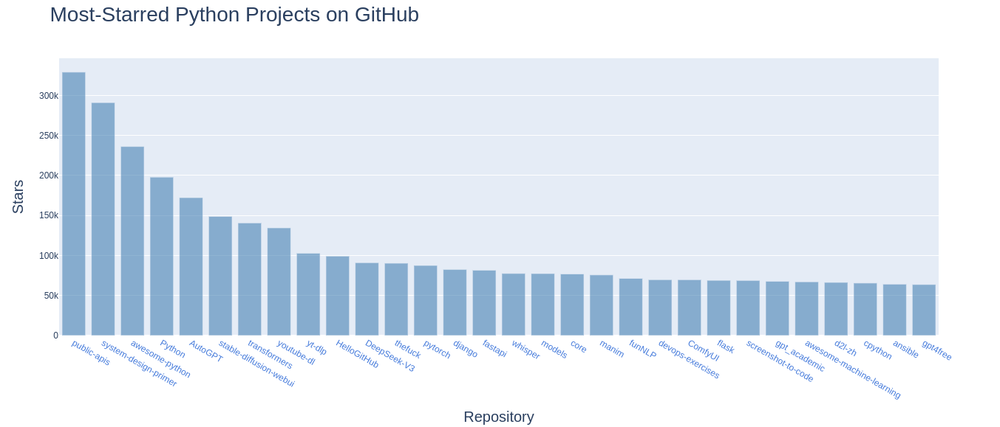

# GitHub Python Repository Visualizer

## 1. Project Overview

This project uses the GitHub API to fetch data about popular Python repositories and creates interactive visualizations of the results. It consists of two main scripts:

- **python_repos.py**: Makes an API call to GitHub to fetch Python repositories sorted by stars and displays the results in the terminal
- **python_repos_visual.py**: Makes the same API call but creates an interactive bar chart visualization using Plotly

The project demonstrates how to:
- Make API calls to external services (GitHub)
- Process JSON responses 
- Create data visualizations from API data
- Build interactive web-based charts

## 2. Dependencies

The project requires the following Python libraries:

- **requests**: For making HTTP requests to the GitHub API
- **plotly**: For creating interactive visualizations

## 3. Setup Instructions

### Installation

1. Clone the repository or download the source files
2. Install the required dependencies:

```bash
pip install requests plotly
```

### GitHub API Rate Limits

Please note that GitHub's API has rate limits for unauthenticated requests. If you plan to make frequent requests, consider [creating a GitHub personal access token](https://docs.github.com/en/authentication/keeping-your-account-and-data-secure/creating-a-personal-access-token) and including it in your requests.

## 4. Running the Visualization

To generate the interactive visualization of the most-starred Python repositories:

```bash
python python_repos_visual.py
```

This will:
1. Make an API request to GitHub
2. Process the response
3. Create an interactive bar chart
4. Open the visualization in your default web browser

## 5. Code Explanation: python_repos_visual.py

The `python_repos_visual.py` script is the main focus of this project. Here's a detailed breakdown of how it works:

### 5.1 Importing Libraries
```python
import requests
import plotly.express as px
```
- `requests`: Used to make HTTP requests to the GitHub API
- `plotly.express`: A high-level interface for creating interactive visualizations

### 5.2 Making the API Request
```python
url = "https://api.github.com/search/repositories"
url += "?q=language:python+sort:stars+stars:>1000"

headers = {"Accept": "application/vnd.github.v3+json"}
r = requests.get(url, headers=headers)
print(f"Status code: {r.status_code}")
```
- Constructs a URL targeting GitHub's repository search API
- Adds query parameters to search for Python repositories with more than 1000 stars, sorted by star count
- Sends a GET request with the appropriate headers to receive the latest version of the API
- Displays the status code (200 means success)

### 5.3 Processing the API Response
```python
response_dict = r.json()
print(f"Complete results: {not response_dict['incomplete_results']}")

repo_dicts = response_dict['items']
repo_links, stars, hover_texts = [], [], []
```
- Converts the JSON response to a Python dictionary
- Checks if the results are complete
- Extracts the repository information from the 'items' key
- Creates empty lists to store the data for visualization

### 5.4 Extracting Repository Data
```python
for repo_dict in repo_dicts:
    # Converts repository names into active links
    repo_name = repo_dict['name']
    repo_url = repo_dict['html_url']
    repo_link = f"<a href='{repo_url}'>{repo_name}"
    repo_links.append(repo_link)
    
    stars.append(repo_dict['stargazers_count'])
    
    # Builds hover texts
    owner = repo_dict['owner']['login']
    description = repo_dict['description']
    hover_text = f"{owner}<br />{description}"
    hover_texts.append(hover_text)
```
- Iterates through each repository in the response
- Creates HTML links from repository names and URLs
- Extracts the star count for each repository
- Creates formatted hover texts with owner name and description

### 5.5 Creating the Visualization
```python
title = "Most-Starred Python Projects on GitHub"
labels = {'x': 'Repository', 'y': 'Stars'}
fig = px.bar(x=repo_links, y=stars, title=title, labels=labels, hover_name=hover_texts)

fig.update_layout(title_font_size=28, xaxis_title_font_size=20, yaxis_title_font_size=20)
fig.update_traces(marker_color='SteelBlue', marker_opacity=0.6)

fig.show()
```
- Sets up the chart title and axis labels
- Creates a bar chart using Plotly Express:
  - X-axis: Repository names (as clickable links)
  - Y-axis: Star counts
  - Hover text: Owner name and repository description
- Customizes the appearance with larger font sizes for the title and axes
- Sets the bar color to SteelBlue with 60% opacity
- Displays the interactive visualization in the default web browser




## 6. Features of the Visualization

The resulting visualization offers several interactive features:

1. **Clickable Repository Names**: Each bar represents a repository, and clicking on its name opens the GitHub page for that repository
2. **Hover Information**: Hovering over a bar displays the repository owner and description
3. **Interactive Controls**: The Plotly interface includes tools for:
   - Zooming in/out
   - Panning
   - Downloading the chart as a PNG
   - Selecting specific areas to zoom

## 7. Extending the Project

Possible enhancements for this project:

1. Add authentication to increase the GitHub API rate limit
2. Include more repository metrics (forks, issues, etc.)
3. Create additional visualizations (line charts for stars over time, etc.)
4. Add filters to explore repositories by different criteria
5. Implement error handling and retry mechanisms for API calls

---
